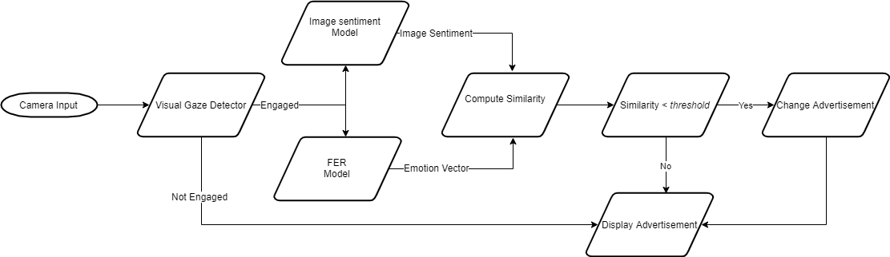

# AdBot
The agent shows ads based on viewer's facial emotion, gaze angle for viewer engagement and sentiment of the ad being shown. The model consists of three parts.

1. Mathematical Model based on sclera ratio in the eyes for Gaze estimation.
2. Fast CNN for Facial Emotion Recognition
3. VCG-based CNN for Image sentiment Dectection

The trained weights are saved for each model. Use the following command to run the bot with the pre-trained weights. 
```Python
python Final/main.py
```



